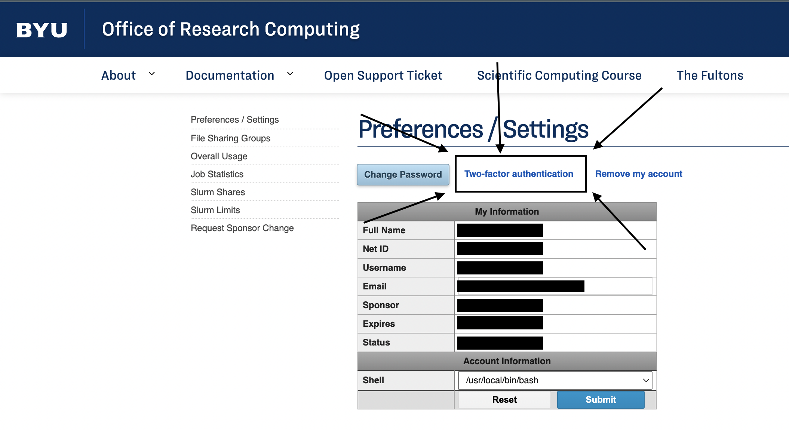
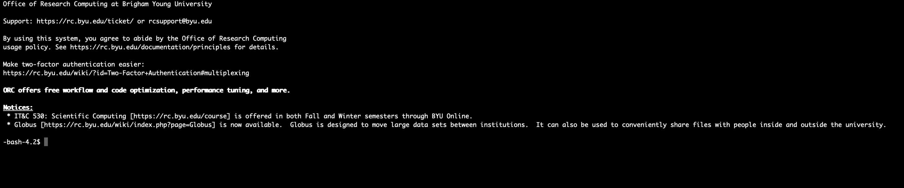
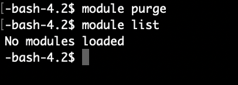
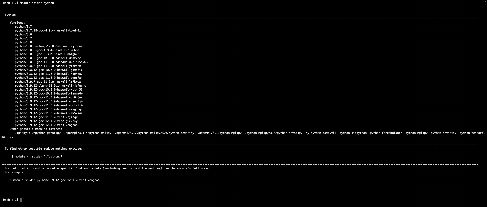
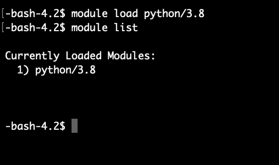
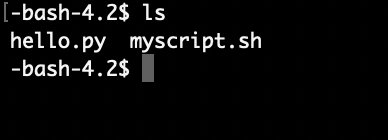
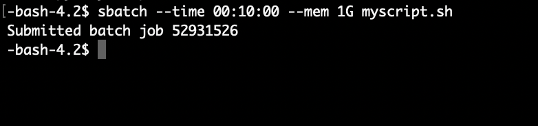
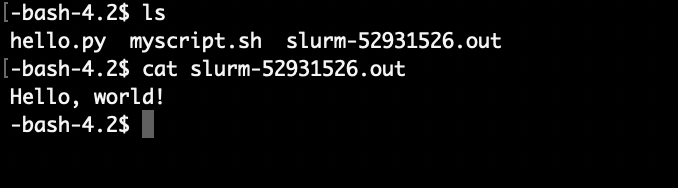

# Logging in and running a simple Python script on the BYU Fulton Supercomputer

These instructions are designed for members of Dr. Fulda's DRAGN Lab to learn how to log in, load modules, and schedule a job script on the BYU Fulton Supercomputer. Through these instructions, you will run a simple Python "Hello, World!" script to understand the basic steps that will apply when running more complex scripts and routines.


## Setup
<br>

1. Clone this github repo using the following command:

```
git clone https://github.com/gknappattack/Supercomputer-Instructions.git
```
<br>

2. Open two separate terminal windows to use during these instructions.

<br>

 One will be used to navigate and copy files from you local machine; the other will be used to remote log into the supercomputer and schedule our jobs. The first window will be referred to as the "local terminal" and the second will be called the "supercomputer terminal" for clarity through the instructions.

<br>

3. In the local terminal, navigate to the newly cloned github folder. 

<br>

4. Check that there is both myscript.sh and hello.py files in the cloned Supercomputer-Instructions folder. 

<br>

5. Switch to the supercomputer terminal window to prepare to log in. 

<br>

Do not close the local terminal window yet, as we will need to return to it in order to copy our script files over to the supercomputer.

<br>


## Logging into the Fulton Supercomputer

With the files cloned with GitHub, the first thing to do is log into the supercomputer using ssh remote login. 

<br>

1. Enable two-factor authentication for your Office of Research Computer account at https://rc.byu.edu/account/. 

<br>

This can be accessed by clicking the “Two-factor authentication” button found below the Preferences/Settings header on the page as seen in the following screenshot.



<br>

Follow the instructions on the page to get your account set up. Two-factor authentication is required by the Office of Research Computing, so you will not be able to login to the supercomputer until this step is completed, even if you already have an approved account.

<br>

__Note: After enabling two-factor authentication, the Office of Research Computer recommends waiting about 10 minutes for their system to update your account status before attempting to login.__
  
<br>

2. Log in to the supercomputer via SSH protocol. The following command can be used to log in once two-factor authentication is enabled.

```
ssh <username>@ssh.rc.byu.edu
```

<br>

Replace the word “username” with the username of your Office of Research Computing account. For example, if your username was john123 the following command would be used to log in.

```
ssh john123@ssh.rc.byu.edu
```

<br>

3. Enter your password when prompted by the terminal.

<br>

4. Enter a verification code retrieved from your authenticator app of choice for two-factor verification that was set up in step 1.

<br>

__Note: If it is your first time logging in with SSH to the supercomputer, you will receive an additional prompt asking if you want to continue connecting to the unknown connection. If you see this prompt, type "yes" and hit Enter to move on.__

<br>


If successful, you should now see a terminal prompt for a login node of the supercomputer as shown in the picture below. 



<br>


## Setting up required modules

<br>

Before scheduling your job script, you need to make sure the correct software modules needed to execute your job are enabled in the shell. In order to run the hello.py file, you need to make sure Python is enabled in the shell before scheduling our job. The supercomputer's module system can be used to load and unload software needed for each job that will be run.

<br>

1. Use the purge command as shown to unload all modules that were previously active in the shell. 

```
module purge
```

<br>

2. Use the list command to ensure that purge removed all previously loaded modules.

<br>

The following command will display a list of all active modules in the current shell.

```
module list
```

<br>

If there are no modules currently loaded, a message is printed to the terminal, as shown in the following screenshot.



<br>

3.  Use the load command to activate a version of Python 3.8 to call in our job script.

```
module load python/3.8
```

<br>

**Tip: If module load does not work for software that you think is available, you can use the spider command to get information about module versions and pre-requisite modules.**

<br>

***If we run the following command, we can see the spider page for the python module.**

```
module spider python
```

**As seen in the screenshot below, there are many versions of Python available to load and spider shows the exact command required to load the module. Even if you don't know the exact module name, spider searches for the best match from your input. When in doubt, try module spider to resolve issues with module load.**



**If module spider does not retrieve any results, contact the Office of Research Computing to request installation of new software.**

<br>

4. Check that only the Python module is currently loaded by using module list again.

<br>

As the following screenshot shows, there is only our Python 3.8 module currently loaded, which is all we need to run our practice job. 



<br>

If you see just the Python 3.8 module loaded, you are now ready to upload our hello.py and myscript.sh files to the supercomputer and schedule the job.

<br>

## Scheduling a Job

<br>

Once the environment is set up, all that is left to do is submit our job to the supercomputer's scheduler and wait for the results. In this section, we will copy the files from our local computer to the supercomputer and send them to the scheduler to be run.

<br>

1. Navigate to the compute node on the super computer. This can be done with the following command.

```
cd compute
```

<br>

2. Switch back to the local terminal window and navigate to the cloned github repository that contains the myscript.sh file.

<br>

3. Use SCP to send the file from your local computer to the supercomputer compute node. This can be done with the following command.

```
scp myscript.sh <username>@ssh.rc.byu.edu:/fslhome/<username>/compute
```

<br>

Every instance of the word username should be replace with the username of your Office of Research Computer account as was done during the login process. 

<br>

4. Type in your account password and anoter verification code to complete the transfer. You can return to the supercomputer terminal window and check that the file appears using the ls command to print working directory contents. 

<br>

You should now see myscript.sh in your compute directory as seen in the screenshot below.

<br>

5. Repeat steps 3 and 4 to send the hello.py script to the compute node.

<br>

6. Check that both files show up in the compute directory using the ls command. If both files were successfully copied over, the ls command show show both of them in the directory as seen in the screenshot below.



<br>

7. Switch back to the supercomputer terminal window. 

<br>

8. From the compute node directory, use the sbatch command to schedule the myscript.sh file. 

```
sbatch –time 00:10:00 –mem 1G <script name>.sh
```

<br>

__Note: There are many flags that can be used with the sbatch command. The BYU supercomputer requires every job to at minimum use the --time flag and the --mem flag. The time flag indicates the maximum planned runtime you wish to allocate for your job before the computer will abandon it. The mem flag designates how much RAM should be dedicated when your job will be run.__

<br>

__For the example sbatch command, we are allocating 10 minutes to run the program and requesting 1 gigabyte of memory for it.__

<br>

__Additional flags and sbatch properties can be viewed at https://slurm.schedmd.com/sbatch.html__

<br>


9. Record the assigned job id that is displayed after scheduling the job. This id can be used to both check job status and confirm the output file belongs to the job. 

<br>

The screenshot below shows the output seen after scheduling a job. The assigned job id is clearly stated after the text "Submitted batch job". 



<br>

## Checking on Job Status and Viewing Output

<br>

Now that your job is scheduled, we can use check the job status and view the output from the supercomputer terminal window.

<br>

1. Check job status using the squeue command and the -j job flag.

```
squeue -j<job id number>
```

<br>

Running the squeue command with the job id number will show the status of the current job. Possible job states include PENDING or RUNNING. If squeue returns an empty response, the job for that id has completed. 

<br>

__Note: Since the job in these instructions is very simple, it will likely be complete before you run squeue. If you see a blank response from squeue, the job is complete and the output file is ready to view.__

<br>

2. View the output file. The output file will appear in the same compute directory that you scheduled the job in. Output files from the supercomputer always come in the form 

```
slurm-<job id number>.out
```

<br>

If our job was assigned the job id 1234 after scheduling it, the output file would appear in the compute directory as seen below.

```
slurm-1234.out
```

<br>

If the previous steps were followed, the output file should contain the line "Hello, World!" as shown in the screenshot below.**



<br>

**Tip: Either the cat command or a preferred Linux text editor program can be used to view the .out file.**

<br>
<br>

Now you are ready to run your research jobs on the supercomputer. Although the files will be more complicated and require more modules to run, the process is the same as outlined in these instructions. 
